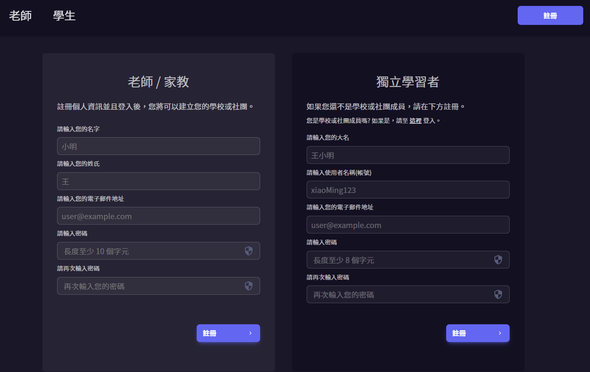
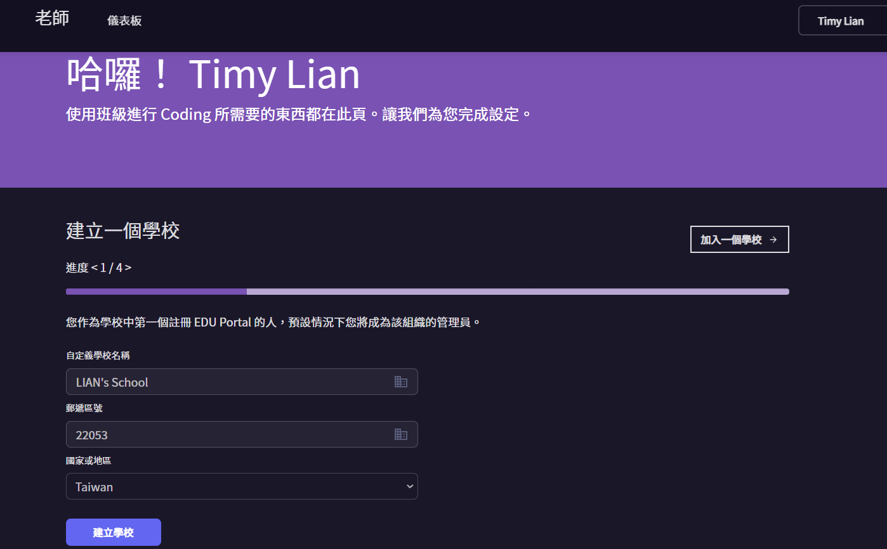
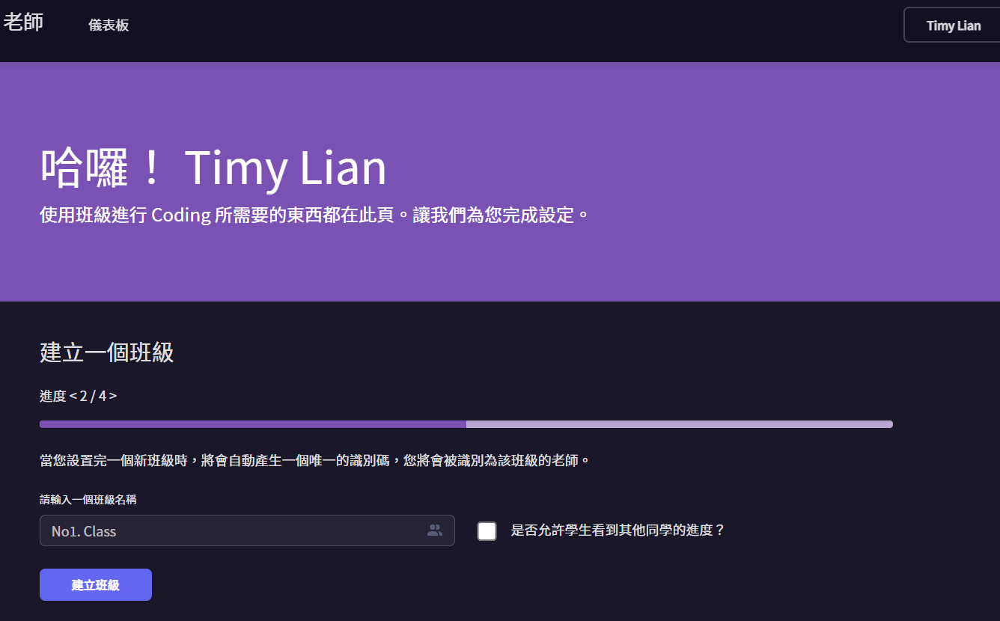
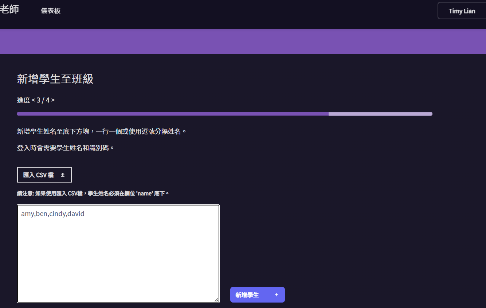

# education-portal

一個免費讓兒童學習程式語言的平台，目前停擺中，之後有時間會再繼續開發。

前端使用基本的 HTML, CSS, JS 與 Bootstrap3
<br>
後端使用 Django 框架，測試框架使用 pytest。

---

### Roles
- Teacher(老師): 能夠建立學校及多個班級，並且在每個班級內，能夠建立帳號並給予學生。
- Student(學生): 指年紀較小的兒童，無法自己註冊帳號，只能透過老師給予的帳號登入。
- Independent Student(獨立學生): 一般的兒童，能夠自己註冊帳號並且登入。

---

### Features

目前只完成了老師即獨立學生的註冊與登入...

---

### Demo
#### 註冊


---

#### 驗證 e-mail(使用 mailhog 本地測試 e-mail)
註冊後需要去收信點擊驗證連結以完成註冊


---

#### 老師儀表板設定: 1 - 建立學校


#### 老師儀表板設定: 2 - 建立班級


#### 老師儀表板設定: 3 - 建立學生帳號
只先需要輸入帳號即可，之後會建立隨機密碼，學生可在登入後自行更改密碼


#### 老師儀表板設定: 4 - 產生學生帳號與連結(完成設定)


---

### How to run

```
cd education-portal/backend
python manage.py runserver --settings backend.settings.dev
```
